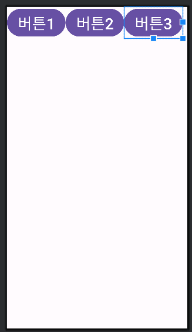

# LinearLayout

## 정의

프로그래머가 지정해 둔 방향대로 **View**를 쌓는다. 먼저 선언한 **View**의 순서대로 **Layout**에 하나씩 차곡차곡 배치하게 된다. **View**들은 겹치지 않는다.

## 배치방향

### orientation

**View**를 배치하는 방향을 수평으로 지정할 수도 있고, 수직으로 지정할 수도 있다.

### horizontal

수평 방향으로 좌측에서 우측으로 **View**를 배치한다. **추가로 weight 값**을 다르게 할경우 길이에 비례해서 맞춰준다.

**예제코드**

```xml
<?xml version="1.0" encoding="utf-8"?>
<LinearLayout xmlns:android="http://schemas.android.com/apk/res/android"
    android:orientation="horizontal"
    android:layout_width="match_parent"
    android:layout_height="match_parent">

    <Button
        android:id="@+id/btn1"
        android:layout_width="wrap_content"
        android:layout_height="wrap_content"
        android:text="버튼1"
        android:textSize="35dp"/>

    <Button
        android:id="@+id/btn2"
        android:layout_width="wrap_content"
        android:layout_height="wrap_content"
        android:text="버튼2"
        android:textSize="35dp"/>

    <Button
        android:id="@+id/btn3"
        android:layout_width="wrap_content"
        android:layout_height="wrap_content"
        android:text="버튼3"
        android:textSize="35dp"/>

</LinearLayout>
```



### vertical

위에서 아래로 쌓는것 수직 방향이다.
이 아이도 마찬가지로 **weight** 값에 따라 비율을 맞춰준다

**예제코드**

```xml
<?xml version="1.0" encoding="utf-8"?>
<LinearLayout xmlns:android="http://schemas.android.com/apk/res/android"
    android:orientation="vertical"
    android:layout_width="match_parent"
    android:layout_height="match_parent">

    <Button
        android:id="@+id/btn1"
        android:layout_width="wrap_content"
        android:layout_height="wrap_content"
        android:text="버튼1"
        android:textSize="35dp"/>

    <Button
        android:id="@+id/btn2"
        android:layout_width="wrap_content"
        android:layout_height="wrap_content"
        android:text="버튼2"
        android:textSize="35dp"/>

    <Button
        android:id="@+id/btn3"
        android:layout_width="wrap_content"
        android:layout_height="wrap_content"
        android:text="버튼3"
        android:textSize="35dp"/>

</LinearLayout>
```


## 정렬 방향

**LinearLayout** 내부에 속해있는 **View**들의 위치를 결정하는 속성이다.**layout_gravity**속성과 **gravity** 속성이 있는데,이름은 비슷해도 사용법은 전혀 다르다.

1.**부모View**의 **자식View**의 정렬 위치를 지정한다.

```xml
android:layout_gravity="위치"
```

2.**View**의 내부 콘텐츠의 위치를 지정한다.

```xml
android:gravity="위치"
```

### 위치값

- 상단정렬:**top**
- 하단정렬:**bottom**
- 좌측정렬:**start**
- 우측정렬:**end**
- 중앙정렬:**center**

**필요한경우**, **|** 연산자를 통해 조합 가능하다.
단, **|** 연산자 사이에 공백이 없어야 한다.

### baselineAligned

**View**들의 높이와 너비가 각각 다를 경우, 기준점을 정해서 정렬을 실시한다. 이 옵션은 **View**들이 수평으로 나란히 있을때인 **horizontal**일때만 된다.

**true**일때는 첫번째 뷰에 **text**를 기준으로 다른 뷰들의 **text** 높이가 맞춰지는거 같다.

**false**는 아는것처럼 위 **top**을 기준으로 맞춰진다.

**상황에 맞게 사용하자**
